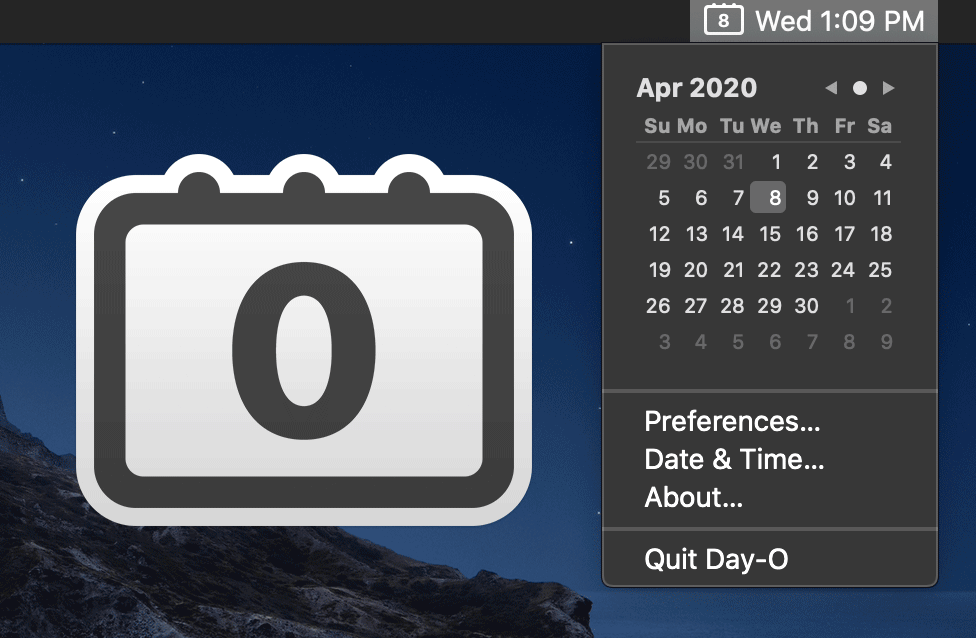

Day-O is a dead simple tab bar app that serves one single purpose. Replacing system menu bar clock with a quick, month-view calendar. Even Calendar or Fantastical takes time to load, Day-O doesn’t, due to its simplicity. Day-O 2 come in very handy if you are on a call and want to check the calendar. It was supposed to be that easy. The new version now supports dark mode and transparency.

[Day-O 3](https://shauninman.com/archive/2020/04/08/day_o_mac_menu_bar_clock_for_catalina) | Made by [Shaun Inman](https://shauninman.com/about/) Available for free on MacOS.
