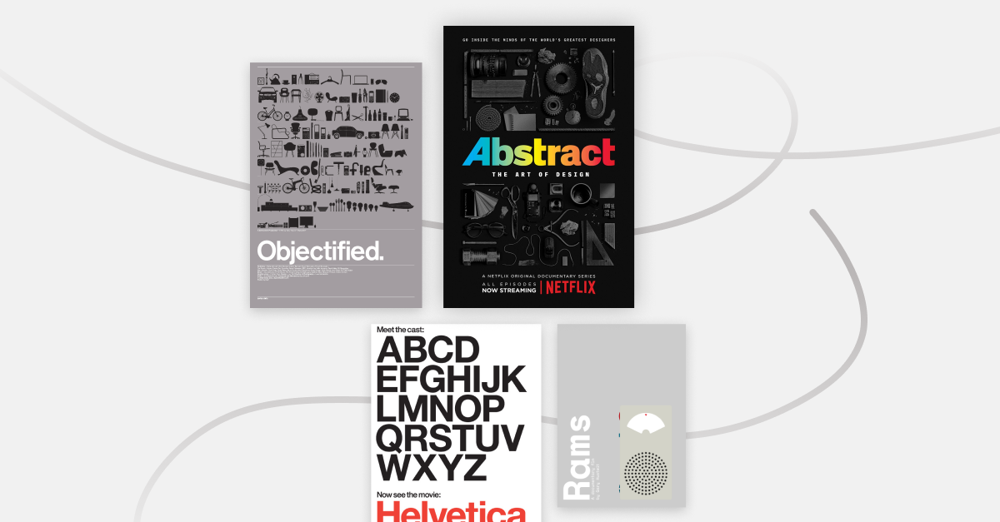

Catching up with some design documentaries in the last few months during quarantine, here's my recommended list!

## Abstract: The Art of Design (Free on Youtube, Available on Netflix)

The two-season documentary series highlight artists across various fields of design. Each episode is an in-depth look of how design is implemented around our everyday life.
@abstractdesign

## Helvetica ($3.99 rental on Vimeo On Demand)

Discover the history and cultural impact of the famous typeface Helvetica, also known as Neue Haas Grotesk.

## Objectified ($3.99 rental on Vimeo On Demand)

Documentary on the manufactured designed objects and the process of its creation. Also directed by the same director Gary Hustwit.

## Rams ($5 rental on 𝗵𝘁𝘁𝗽𝘀://𝗵𝘂𝘀𝘁𝘄𝗶𝘁.𝘃𝗵𝘅.𝘁𝘃/)

After interviewing Dieter Rams in Objectified, director Gary Hustwit started a new project to continue the conversation with him, further exploring this key design figure in influencing modern industrial design.

Got any favourite design documentaries to share? Leave a comment below!
