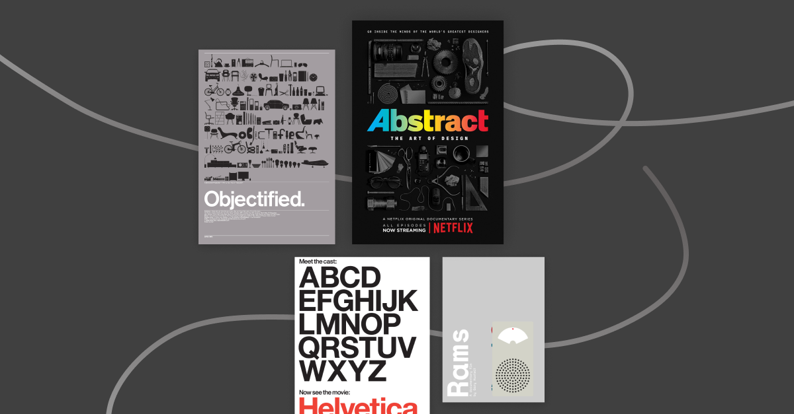

Catching up with some design documentaries in the last few months during quarantine, here's my recommended list!

## 𝗔𝗯𝘀𝘁𝗿𝗮𝗰𝘁: 𝗧𝗵𝗲 𝗔𝗿𝘁 𝗼𝗳 𝗗𝗲𝘀𝗶𝗴𝗻 (𝗙𝗿𝗲𝗲 𝗼𝗻 𝗬𝗼𝘂𝘁𝘂𝗯𝗲, 𝗔𝘃𝗮𝗶𝗹𝗮𝗯𝗹𝗲 𝗼𝗻 𝗡𝗲𝘁𝗳𝗹𝗶𝘅)

The two-season documentary series highlight artists across various fields of design. Each episode is an in-depth look of how design is implemented around our everyday life.
@abstractdesign

## 𝗛𝗲𝗹𝘃𝗲𝘁𝗶𝗰𝗮 (\$𝟯.𝟵𝟵 𝗿𝗲𝗻𝘁𝗮𝗹 𝗼𝗻 𝗩𝗶𝗺𝗲𝗼 𝗢𝗻 𝗗𝗲𝗺𝗮𝗻𝗱)

Discover the history and cultural impact of the famous typeface Helvetica, also known as Neue Haas Grotesk.

## 𝗢𝗯𝗷𝗲𝗰𝘁𝗶𝗳𝗶𝗲𝗱 (\$𝟯.𝟵𝟵 𝗿𝗲𝗻𝘁𝗮𝗹 𝗼𝗻 𝗩𝗶𝗺𝗲𝗼 𝗢𝗻 𝗗𝗲𝗺𝗮𝗻𝗱)

Documentary on the manufactured designed objects and the process of its creation. Also directed by the same director Gary Hustwit.

## 𝗥𝗮𝗺𝘀 (\$𝟱 𝗿𝗲𝗻𝘁𝗮𝗹 𝗼𝗻 𝗵𝘁𝘁𝗽𝘀://𝗵𝘂𝘀𝘁𝘄𝗶𝘁.𝘃𝗵𝘅.𝘁𝘃/)

After interviewing Dieter Rams in Objectified, director Gary Hustwit started a new project to continue the conversation with him, further exploring this key design figure in influencing modern industrial design.

Got any favourite design documentaries to share? Leave a comment below!
